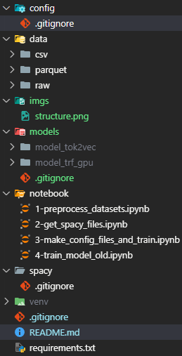

# Big Data

# Introdução 
Projeto relizado pelo aluno **Matheus Marques Eiras** para a diciplina de sexto perio do curso de ciência da computação no Instituto Federal do Paraná (IFPR-Pinhais).

Este projeto procura desenvolver um modelo de *Named Entity Recognition* (NER) em que busca recohecer uma serie de entidades

# Entidades usadas 
| Dataset                        | Entidades                                                                                                                                                                                                                                                               | Liceça             |
| :----------------------------: | :---------------------------------------------------------------------------------------------------------------------------------------------------------------------------------------------------------------------------------------------------------------------: | :----------------: |
| Multilingual NER Dataset       | {'O': 0, 'B-PER': 1, 'I-PER': 2, 'B-ORG': 3, 'I-ORG': 4, 'B-LOC': 5, 'I-LOC': 6, 'B-MISC': 7, 'I-MISC': 8}                                                                                                                                                              | CC0: Public Domain |
| LeNER-Br: Portuguese Legal NER | {"O", "B-ORGANIZACAO", "I-ORGANIZACAO", "B-PESSOA", "I-PESSOA", "B-TEMPO", "I-TEMPO", "B-LOCAL", "I-LOCAL", "B-LEGISLACAO", "I-LEGISLACAO", "B-JURISPRUDENCIA", "I-JURISPRUDENCIA}                                                                                      | CC0: Public Domain |
| HAREM Portuguese NER Corpus    | {"O", "B-PESSOA", "I-PESSOA", "B-ORGANIZACAO", "I-ORGANIZACAO", "B-LOCAL", "I-LOCAL", "B-TEMPO", "I-TEMPO", "B-VALOR", "I-VALOR", "B-ABSTRACCAO", "I-ABSTRACCAO", "B-ACONTECIMENTO", "I-ACONTECIMENTO", "B-COISA", "I-COISA", "B-OBRA", "I-OBRA", "B-OUTRO", "I-OUTRO"} | CC0: Public Domain |

## Datasets utiluzados
- MultL: https://www.kaggle.com/datasets/thedevastator/multilingual-ner-dataset | https://huggingface.co/datasets/Babelscape/wikineural
- LeNER-Br: https://www.kaggle.com/datasets/thedevastator/lener-br-portuguese-legal-ner-dataset | https://github.com/peluz/lener-br/blob/master/leNER-Br/train/train.conll
- HAREM: https://www.kaggle.com/datasets/thedevastator/harem-portuguese-ner-corpus | https://github.com/gdutramartins/po-ner-2-portuguese-ner/tree/main/dataset

# Execução

## Instalação 

Para roda este codigo é necessario instalar o CUDA Tool kit da nvidia instalado, o compilador de C/C++ do visual studio, o pytorch referente a verção do CUDA instalado no sistema é recomendado a verção 12.8

### CUDA

para instalar o CUDA basta seguir as instruções presentes em 

``` bash
https://developer.nvidia.com/cuda-12-8-0-download-archive
```

### Bivliotecas python

#### Ambiente virtual

Para iniciar o ambiente virtual e ativa-lo para instalar bibliotecas basta (O python recomendado é 3.10)

``` bash
python -m venv venv
venv\Scripts\activate
```

#### Pytorch

Para instalar o pythorch recomendado é necessario usar o comando 

``` bash
pip3 install torch torchvision --index-url https://download.pytorch.org/whl/cu128
```

#### spaCy

Para instalar a biblioteca spacy basta usar o comando

``` bash
pip install -U 'spacy[cuda12x,transformers,lookups]'
```

para mais informações ou eros durante a instalaçõa ```https://spacy.io/usage```

Por fim para instalar as outras dependências basta usar

```bash
pip install tqdm pandas fastparquet pyarrow
```

## Rodar o projeto 

### Preparação do ambiente 

Baixar o arquivo ```data.7z``` disponivel no site Hugginface
``` bash
https://huggingface.co/datasets/MatheusMarquesEiras/project-bigdata/tree/main
```

Assim a estrutura deve ficar como na imagem



OBS: para ter acesso aosmodelos já treinados basta bixa-los no reposiório ```https://huggingface.co/MatheusMarquesEiras/NER-bigdata/tree/main```

### Ordem para rodar

A ordem que os notebooks (presentes na pasta "notebook") é a seguinte 

- 1-preprocess_datasets.ipynb
- 2-get_spacy_files.ipynb
- 3-make_config_files_and_train.ipynb

Agora o notebook ```4-train_model_old.ipynb``` é apenas o código que foi usado de base pelo projeto escolhido (https://amanxai.com/2020/12/25/named-entity-recognition-with-python/#google_vignette)