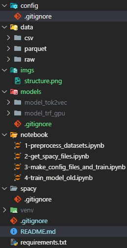

# Big Data - Named Entity Recognition (NER)

<p align="center">
  
</p>

## 📌 Introdução 

Projeto realizado pelo aluno **Matheus Marques Eiras** para a disciplina de sexto período do curso de Ciência da Computação no Instituto Federal do Paraná (IFPR-Pinhais).

Este projeto visa desenvolver um modelo de *Named Entity Recognition* (NER) capaz de identificar uma série de entidades em textos em português e multilíngues.

---

## 📊 Entidades Suportadas

| Dataset | Entidades | Licença |
| :--- | :--- | :---: |
| **Multilingual NER Dataset** | PER, ORG, LOC, MISC | CC0 |
| **LeNER-Br (Legal NER)** | ORG, PESSOA, TEMPO, LOCAL, LEGISLAÇÃO, JURISPRUDÊNCIA | CC0 |
| **HAREM Corpus** | PESSOA, ORGANIZAÇÃO, LOCAL, TEMPO, VALOR, ABSTRAÇÃO, ACONTECIMENTO, COISA, OBRA, OUTRO | CC0 |

### 🔗 Datasets Utilizados
*   **Multilingual NER:** [Kaggle](https://www.kaggle.com/datasets/thedevastator/multilingual-ner-dataset) | [HuggingFace](https://huggingface.co/datasets/Babelscape/wikineural)
*   **LeNER-Br:** [Kaggle](https://www.kaggle.com/datasets/thedevastator/lener-br-portuguese-legal-ner-dataset) | [GitHub](https://github.com/peluz/lener-br)
*   **HAREM:** [Kaggle](https://www.kaggle.com/datasets/thedevastator/harem-portuguese-ner-corpus) | [GitHub](https://github.com/gdutramartins/po-ner-2-portuguese-ner)

---

## 🚀 Execução e Instalação

### Pré-requisitos
Para rodar este projeto com aceleração de GPU, é necessário:
1.  **NVIDIA CUDA Toolkit** (versão recomendada: 12.8).
2.  **Compilador C/C++** (Visual Studio Build Tools).
3.  **Python 3.10**.

#### 1. Instalação do CUDA
Siga as instruções oficiais em: [NVIDIA CUDA Download](https://developer.nvidia.com/cuda-12-8-0-download-archive)

#### 2. Ambiente Virtual
```bash
python -m venv venv
# No Windows:
.\venv\Scripts\activate
```

#### 3. Dependências Principais (PyTorch & spaCy)
```bash
# PyTorch com suporte a CUDA 12.8
pip3 install torch torchvision --index-url https://download.pytorch.org/whl/cu128

# spaCy com suporte a Transformers e GPU
pip install -U 'spacy[cuda12x,transformers,lookups]'
```
*Para mais detalhes ou erros na instalação, consulte [spacy.io/usage](https://spacy.io/usage).*

#### 4. Outras Bibliotecas
```bash
pip install tqdm pandas fastparquet pyarrow
```

---

## 📂 Como Rodar o Projeto

### Preparação do Ambiente 
1. Baixe o arquivo `data.7z` disponível no [HuggingFace](https://huggingface.co/datasets/MatheusMarquesEiras/project-bigdata/tree/main).
2. Extraia o conteúdo para que a estrutura de diretórios siga o padrão abaixo:



> **Nota:** Para utilizar os modelos já treinados, baixe-os em: [NER-bigdata Repository](https://huggingface.co/MatheusMarquesEiras/NER-bigdata/tree/main)

### Ordem de Execução
Os notebooks na pasta `notebook/` devem ser executados na seguinte ordem:

1.  `1-preprocess_datasets.ipynb`: Limpeza e preparação dos dados.
2.  `2-get_spacy_files.ipynb`: Conversão para o formato binário do spaCy.
3.  `3-make_config_files_and_train.ipynb`: Configuração e treinamento do modelo.

*O arquivo `4-train_model_old.ipynb` contém o código base utilizado como referência inicial (créditos: [Aman Kharya](https://amanxai.com/2020/12/25/named-entity-recognition-with-python/)).*
